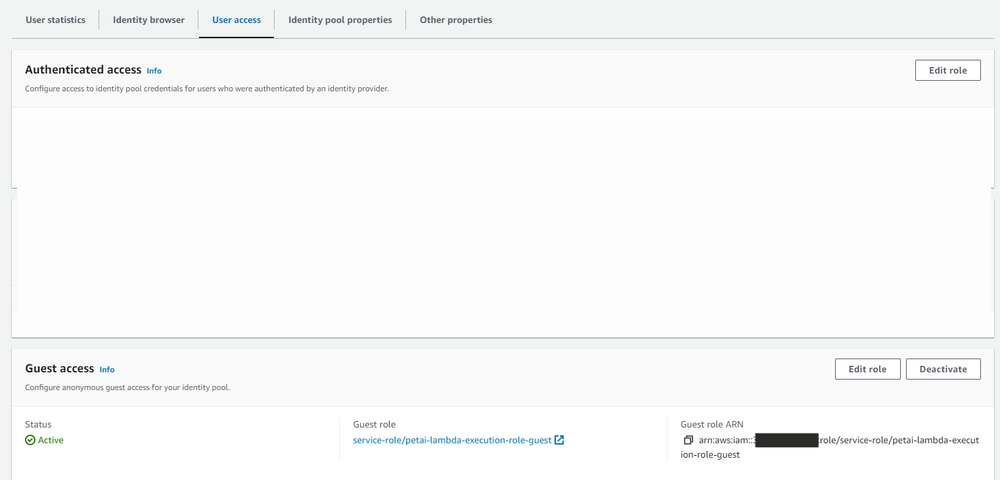
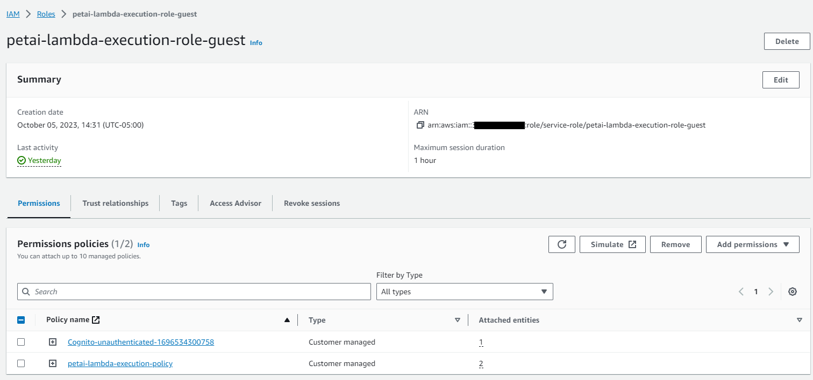

# PetAi Example

The PetAI Example was compiled for re:Invent 2023 as part of a presentation.  The code provided in this repository is **not** intended to be used in production setting.  Although Cognito integraion was included to make it easier to run the code from a local browser, it should not imply that there is true Authentication/Authorization rigor included. 

## Architecture

 

Although the architecture was originally designed to utilize Amplify for front-end development, given some time constraints the HTML that is included directly invokes Cognito User Pool and Identity Pool guest user access to issue temporary credentials so it will run in your local browser.  It should behave the same as part of an Amplify project but that was not tested for the final solution.

Clone this repository
git clone git@github.com:fgraichen/petai.git   (SSH)
https://github.com/fgraichen/petai.git  (HTTPS)

## Front End Configuration 
Change directory to client directory

## Cognito Configuration

The solution utilizes a cognito user pool and identity pool mapping to an IAM role.  This this is the role which is then used for invoking the Lambda directly from the browser.  If more security was required it would have been possible to integrate with a Hosted Login solution but that was not a requirement for the demonstration.

The steps for configuring this this solution are outlined here:
https://docs.aws.amazon.com/cognito/latest/developerguide/identity-pools.html

The key to the above process is configuring guest access updating the role that is mapped to include invoke permissions on the lambda you will create.

Guest Role Configuration example

Example policy below:

To utilize the identity pool and the guest access via your HTML client you will need to record your identity pool id.  

### JavaScript Code Example

### Edit code
Clone this repository
git clone git@github.com:fgraichen/petai.git   (SSH)
https://github.com/fgraichen/petai.git  (HTTPS)

## Front End Configuration 
Change directory to client directory
Edit the petaisecure.html  
Replace the identity pool information as illustrated above

You will not have lambda information so you can leave this file open or return later.

# Create lambda and DynamoDB table using SAM 

SAM (Serverless Application Model) is used to package and deploy the application.   The template.yaml is designed to create a Lambda function and a DynamoDB table.  

Utilize the following link to install the SAM CLI

Change directory to the SAM directory.  This directory contains the SAM template (tempolate.yamml) as well as a subdirectory (testai) containing the application code for your Lambda function.  The template will build your Lambda code as well as its permissions to invoke Bedrock and update your DynamoDB

Build the application dependencies:
sam build

Deploy the SAM Application 
sam deploy --guided

Note:  If you change the directory name for code (testai) to some other value, you need to update the codeuri field in the template.

Validate that the cloudfomation stack executed successfully and record the name of the Lambda function created.  The TestAIFunction arn will be in the output of the cloudformation stack execution.   The template should also have created a DynamoDB table called PetTracker.  Your Lambda code will update this table for every execution with the Model-Id (Hash), Datetime(Sort), prompt and result attributes. 

Return to your petaisecure.html page and update the lambda invocation with your function name.

The format will be similar to arn:aws:lambda:us-east-1:#######:function:testaiapp-TestAIFunction-9XXXXKsr

This should complete your changes to the html page.

# Update you IAM guest role created in the  Cognito configuration step

Guest Role Configuration example

Example policy below:

Replace the sample arn with the arn of the lambda function created.

Note:  Failure to update this role will result in an error similar to the following when you access the function from the HTML client :
Error calling Lambda function: User: arn:aws:sts::###########:assumed-role/XXXXX-lambda-execution-role-guest/CognitoIdentityCredentials is not authorized to perform: lambda:InvokeFunction on resource: arn:aws:lambda:us-east-1:########:function:testaiapp-TestAIFunction-9XXXXXsr because no identity-based policy allows the lambda:InvokeFunction action

## Bedrock 
Validate that you have access to the model you are going to work with.  In this case it is the Claude Instant model

Add inline policy to your Lambda exection role

Use the following as an example of the IAM configuration

Open your petaisecure.html page and if the above steps have been completed successfully you should be able to invoke your lambda.

Bonus:

https://docs.aws.amazon.com/codewhisperer/
https://docs.aws.amazon.com/codewhisperer/latest/userguide/getting-started.html

In your IDE use the following CodeWhisperer prompts (Python in VS Code was used for this process) to build a test DynamoDB update and scan for some local testing

#use region us-east-1 to connect to dynamodb
#import datetime
#create python funtion update_pettracker_table(prompt, result)    

#update  dynamodb table named pettracker with a new entry with Model-Id = "anthropic.claude-v1" and DT = str(datetime.datetime.now()) and prompt = prompt and result = result     

#create function to scan dynamodb table named pettracker and return all item

#call scan_dynamodb_table(pettracker) and iterate through the items and print each item 

         

