# Note:  You will need python 3.9 or above for the SAM section of this build 
## Note:  You must deploy this solution to a valid Bedrock region -  This was tested in  the US-EAST-1 region

# PetAi Example

The PetAI Example was compiled for re:Invent 2023 as part of a presentation.  The code provided in this repository is **not** intended to be used in production setting.  Although Cognito integraion was included to make it easier to run the code from a local browser, it should not imply that there is true Authentication/Authorization rigor included. 

Clone this repository
git clone git@github.com:fgraichen/testai.git   (SSH)
https://github.com/fgraichen/testai.git  (HTTPS)

## Architecture

 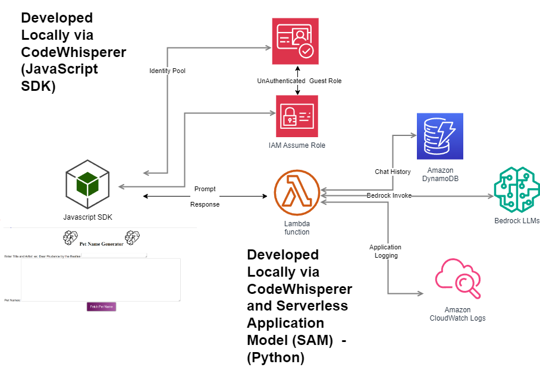

Although the architecture was originally designed to utilize Amplify for front-end development, given some time constraints the HTML that is included directly invokes Cognito User Pool and Identity Pool guest user access to issue temporary credentials so it will run in your local browser.  It should behave the same as part of an Amplify project but that was not tested for the final solution.

# Create lambda and DynamoDB table using SAM  - python 3.9 or later needs to be in your execution path

SAM (Serverless Application Model) is used to package and deploy the application.   The template.yaml is designed to create a Lambda function and a DynamoDB table.  

Utilize the following link to install the SAM CLI
https://docs.aws.amazon.com/serverless-application-model/latest/developerguide/install-sam-cli.html

Change directory to the SAM directory.  This directory contains the SAM template (tempolate.yamml) as well as a subdirectory (testai) containing the application code for your Lambda function.  The template will build your Lambda code as well as its permissions to invoke Bedrock and update your DynamoDB

Build the application dependencies:
sam build

Deploy the SAM Application 
sam deploy --guided

Note:  If you change the directory name for code (testai) to some other value, you need to update the codeuri field in the template.

Validate that the cloudfomation stack executed successfully and record the name of the Lambda function created.  The TestAIFunction arn will be in the output of the cloudformation stack execution.   The template should also have created a DynamoDB table called PetTracker.  Your Lambda code will update this table for every execution with the Model-Id (Hash), Datetime(Sort), prompt and result attributes. 

Record the name of the generated Lambda function.

The format will be similar to testaiapp-TestAIFunction-9XXXXK

Save the html page.  

## Cognito Configuration

The solution utilizes a cognito user pool and identity pool mapping to an IAM role.  This this is the role which is then used for invoking the Lambda directly from the browser.  If more security was required it would have been possible to integrate with a Hosted Login solution but that was not a requirement for the demonstration.

The steps for configuring this this solution are outlined here:
https://docs.aws.amazon.com/cognito/latest/developerguide/identity-pools.html    Note: You will only be using Unauthenticated Access -  Instructions in link are for general guidance 

The key to the above process is configuring guest access updating the role that is mapped to include invoke permissions on the lambda you will create.

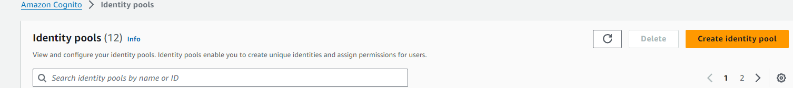
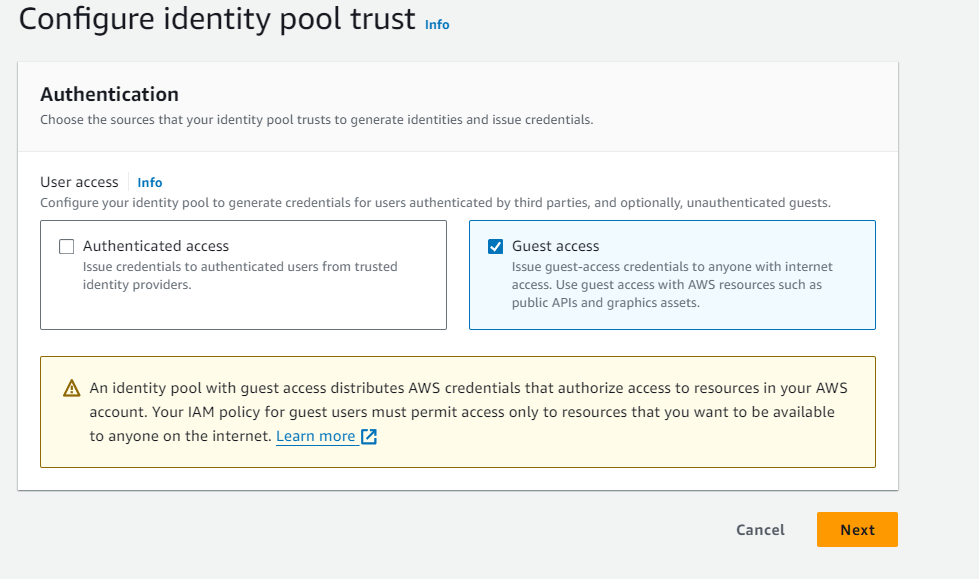
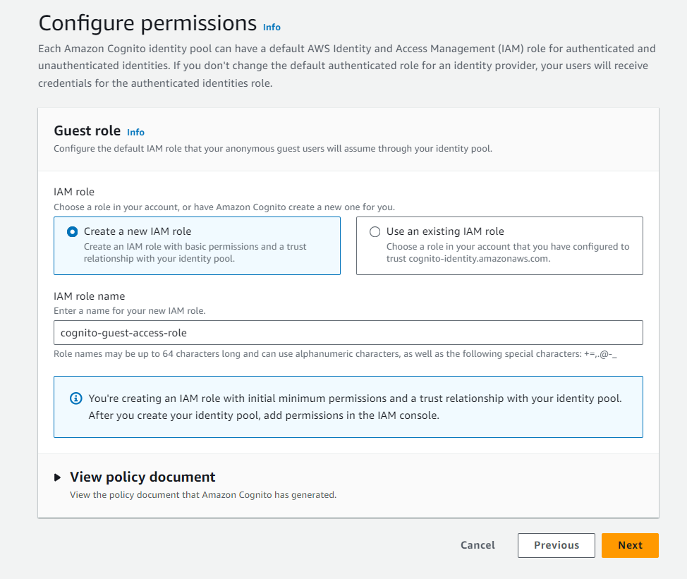
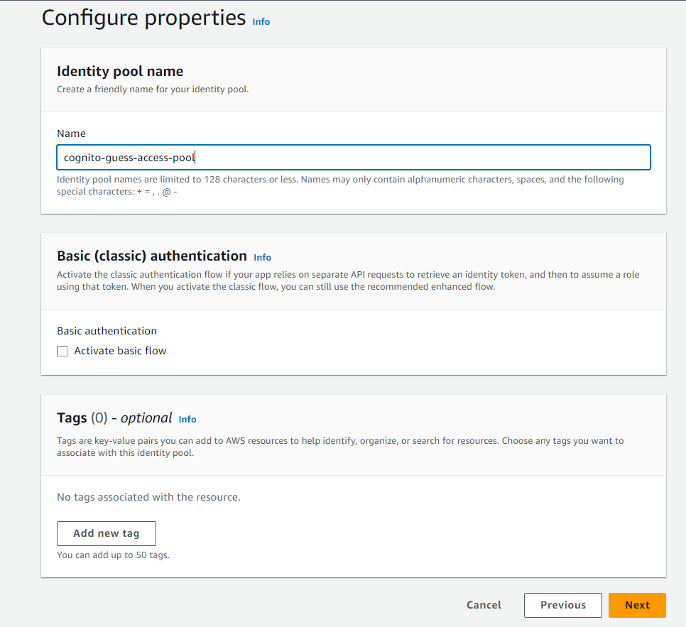
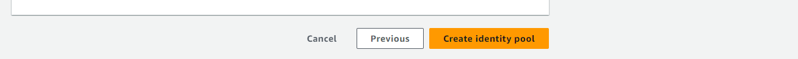
Save the name of your identity pool for later.  You will specify this in the client html page. 

Switch to IAM to update the permissions of your guest access role.

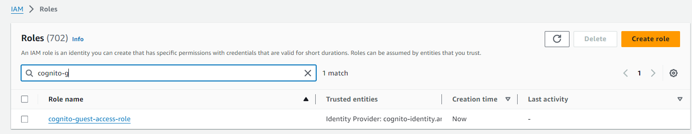
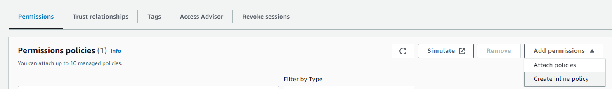

Note:  Failure to update this role will result in an error similar to the following when you access the function from the HTML client :
Error calling Lambda function: User: arn:aws:sts::###########:assumed-role/XXXXX-lambda-execution-role-guest/CognitoIdentityCredentials is not authorized to perform: lambda:InvokeFunction on resource: arn:aws:lambda:us-east-1:########:function:testaiapp-TestAIFunction-9XXXXXsr because no identity-based policy allows the lambda:InvokeFunction action

Example policy below:

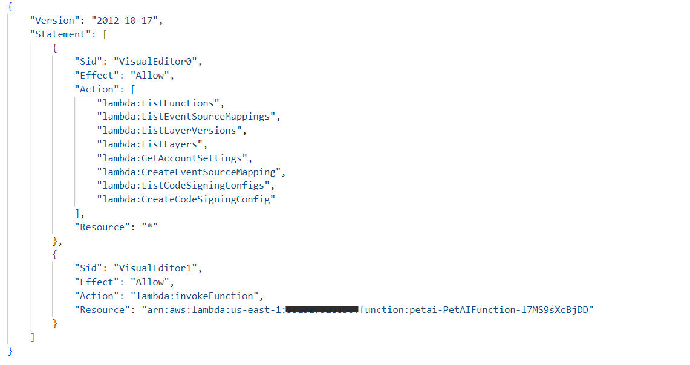

{
    "Version": "2012-10-17",
    "Statement": [
        {
            "Sid": "VisualEditor0",
            "Effect": "Allow",
            "Action": [
                "lambda:ListFunctions",
                "lambda:ListEventSourceMappings",
                "lambda:ListLayerVersions",
                "lambda:ListLayers",
                "lambda:GetAccountSettings",
                "lambda:CreateEventSourceMapping",
                "lambda:ListCodeSigningConfigs",
                "lambda:CreateCodeSigningConfig"
            ],
            "Resource": "*"
        },
        {
            "Sid": "VisualEditor1",
            "Effect": "Allow",
            "Action": "lambda:invokeFunction",
            "Resource": "arn:aws:lambda:us-east-1:351927928856:function:petai-PetAIFunction-XXXXXXXXXX"
        }
    ]
}

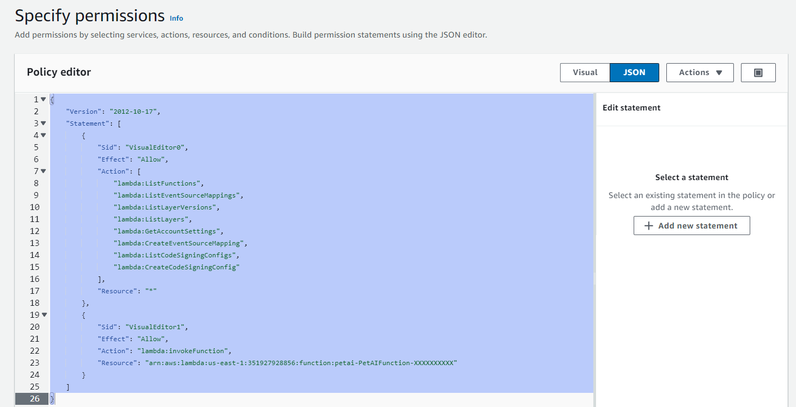
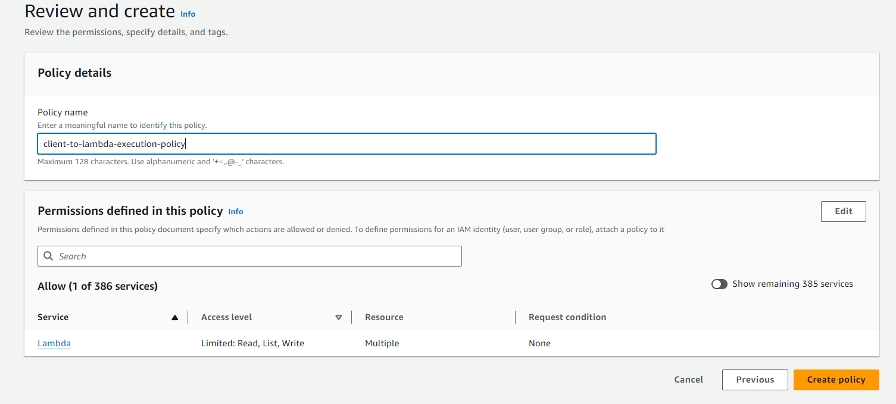
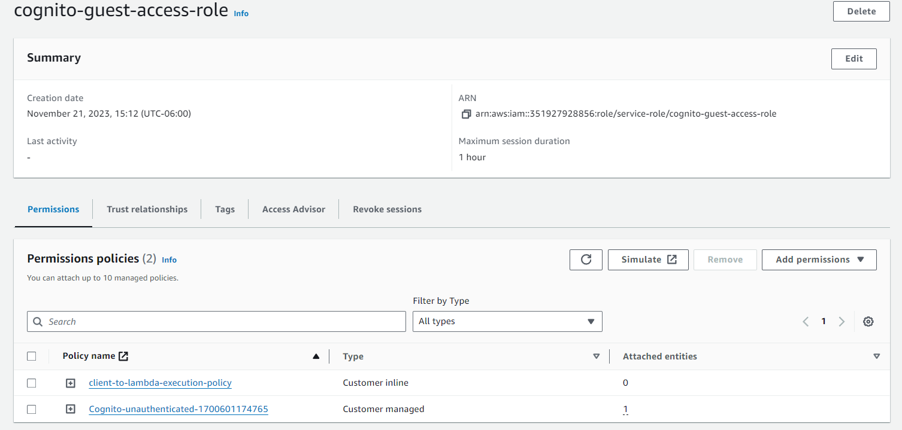

## Front End Configuration 
Change directory to client directory 
Edit the petaisecure.html  
Replace the identity pool information as illustrated above
Replace the lambda function invoke to invoke the Lambda function created above

To utilize the identity pool and the guest access via your HTML client you will need to record your identity pool id.  

### JavaScript Code Example

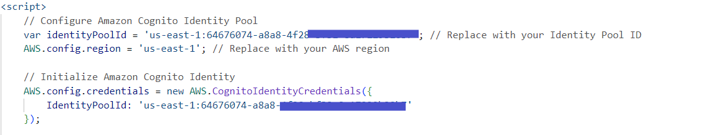

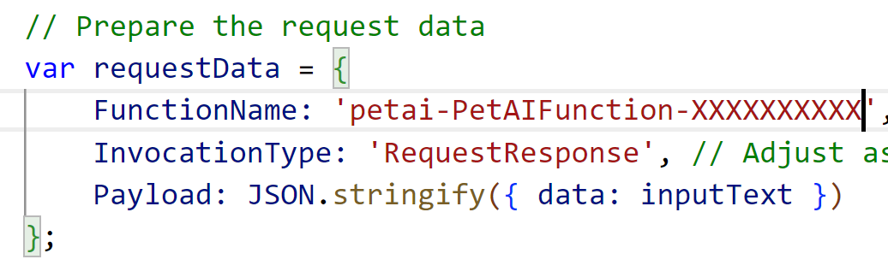

Save the html file.

## Bedrock 
Validate that you have access to the model you are going to work with.  In this case it is the Claude Instant model

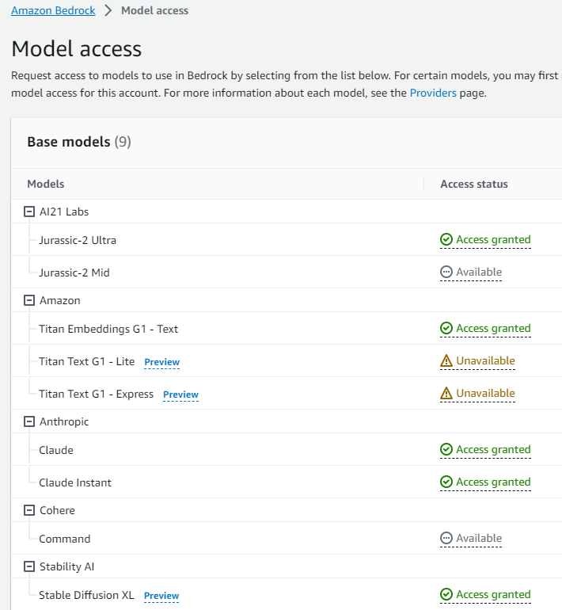

Add inline policy to your Lambda exection role

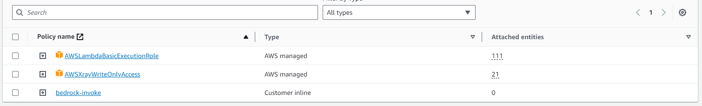

Use the following as an example of the IAM configuration

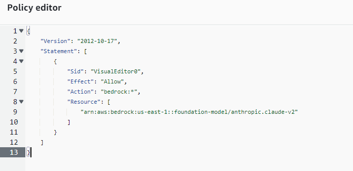

Change to the client directory
Open your petaisecure.html page and if the above steps have been completed successfully you should be able to invoke your lambda.

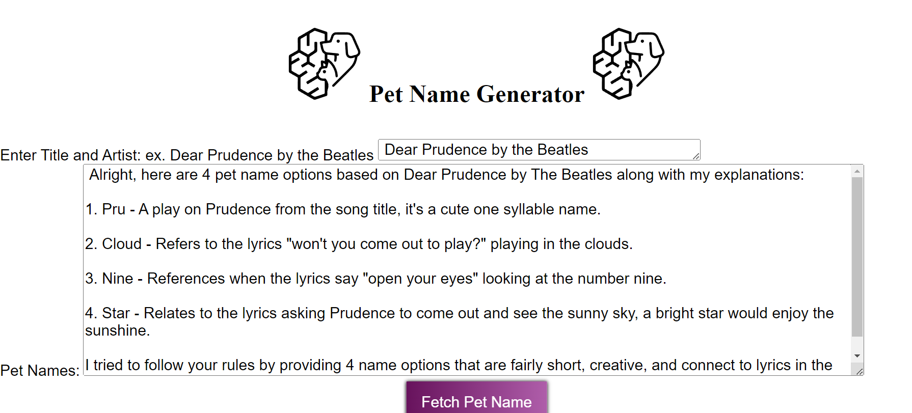

Bonus:

https://docs.aws.amazon.com/codewhisperer/
https://docs.aws.amazon.com/codewhisperer/latest/userguide/getting-started.html

In your IDE use the following CodeWhisperer prompts (Python in VS Code was used for this process) to build a test DynamoDB update and scan for some local testing.

#create python funtion update_pettracker_table(prompt, result)

#update dynamodb table named PetTrackerDemo with a new entry with Model-Id = "anthropic.claude-v1" and DT = str(datetime.datetime.now()) and prompt = prompt and result = result
   

#create function scan_pettracker_table to scan dynamodb table named PetRrackerDemo and return all items

#create main function and call update_pettracker_table passing in "hello", "re:Invent2023" and then call scan_petracker_table and iterate and print all items

         

